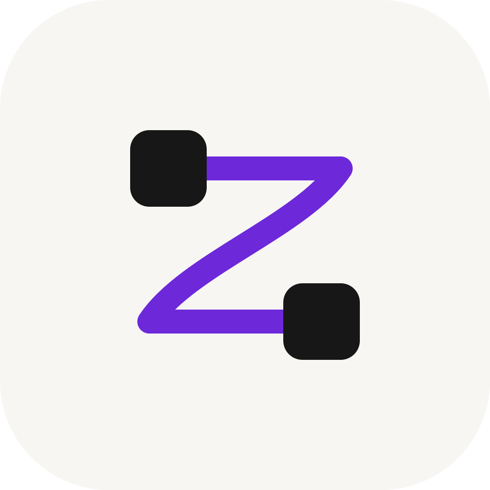

<p align="center">
  
</p>

<h1 align="center">ZFlow</h1>

<p align="center">
  <b>Hold a key. Speak. It's typed.</b><br>
  Wispr Flow–style dictation for your Mac. Free, private, instant.
</p>

<p align="center">
  <a href="https://github.com/AdamPomposelli/ZFlow/releases/latest"></a>
  
  
  
  <a href="LICENSE"></a>
</p>

<p align="center">
  <a href="https://github.com/AdamPomposelli/ZFlow/releases/latest/download/ZFlow.dmg">
    
  </a>
  <br>
  <sub>No account · No subscription · <a href="#quick-start">Ready in 2 minutes</a></sub>
</p>

<!-- 🎬 Teaser video goes here. -->

---

## 💜 Why ZFlow

Dictation apps usually make you pick two of three: **free**, **private**, **good**.
ZFlow is all three.

<table>
  <tr>
    <td align="center" width="72"><h3>💸</h3></td>
    <td><b>Free. Really.</b><br>No subscription, no word cap, no account. On-device mode costs nothing, today and every day after.</td>
  </tr>
  <tr>
    <td align="center"><h3>🔒</h3></td>
    <td><b>Private by design.</b><br>On-device mode keeps your voice on your Mac. No telemetry, no analytics, no ZFlow servers. There is nothing to send it to.</td>
  </tr>
  <tr>
    <td align="center"><h3>✨</h3></td>
    <td><b>Output you'd have typed.</b><br>Raw words the instant you let go, or clean prose with the filler gone, the punctuation right and your own jargon spelled correctly.</td>
  </tr>
</table>

|  | **ZFlow** | Subscription dictation apps |
|---|:---:|:---:|
| 💸 Price | **Free** | Monthly fee |
| 📏 Word limit | **None** | Often capped on free plans |
| 👤 Account | **Not needed** | Required |
| 🎙️ Where your voice goes | **Your Mac**, or the provider *you* pick | Their servers |
| 🧩 Speech engine | **Apple on-device, Groq, OpenAI, ZenMux, any OpenAI-compatible API** | Theirs |
| 📖 Source code | **Open, MIT** | Closed |

> [!NOTE]
> **Built by people who dictate all day.** ZFlow is made by the team at Zippy, and we use it every day for everything we write. If something gets in the way, we feel it first.

<a id="quick-start"></a>

## ⏱️ Quick start

From download to your first dictation in **under 2 minutes**.

| | Step | ⏱ |
|:-:|---|:-:|
| **1** | ⬇️ **[Download ZFlow.dmg](https://github.com/AdamPomposelli/ZFlow/releases/latest/download/ZFlow.dmg)**, open it, and drag ZFlow onto Applications. | 20 s |
| **2** | 🔓 **Open ZFlow.** macOS blocks the first launch: go to *System Settings → Privacy & Security* and click **Open Anyway**. | 20 s |
| **3** | ✅ **Grant Microphone and Accessibility.** ZFlow opens right on them: one click each. | 20 s |
| **4** | 🏠 **Go local.** In *Voice & AI*, set *Speech to text* and *Cleanup* to **On this Mac**. Free, unlimited, private. | 15 s |
| **5** | 🎙️ **Hold <kbd>fn</kbd>, speak, let go.** Your words appear wherever your cursor is. | <b>0&nbsp;s&nbsp;⚡</b> |

> [!TIP]
> **Not on macOS 26 yet?** On-device mode needs it. Pick a cloud provider in *Voice & AI* instead and paste your key. Groq has a free tier.

> [!IMPORTANT]
> Step 2 is there because ZFlow isn't notarised by Apple yet. You do it once. If macOS asks the same about *ZFlow UI*, the settings window, approve it the same way.

## 🎮 Pick your mode

One click in *Post-Processing* switches between them. Mix and match the settings and it becomes **Custom**.

| | Mode | Wait | What you get |
|:-:|---|:-:|---|
| ⚡ | **Fast** | **0 s** | Exactly what you said, the instant you let go. |
| 🎯 | **Normal** | ~1 s | Cleaned up: punctuation, filler words, your vocabulary, tuned to the app you're in. |
| 💎 | **Quality** | ~3 s | Everything in Normal, plus a look at the window you're typing into for perfect context. |

## ✨ Everything it does

<table>
  <tr>
    <td width="50%" valign="top">⚡ <b>Dictate anywhere</b><br>Hold <kbd>fn</kbd> in any app, speak, let go. The text lands where your cursor is.</td>
    <td width="50%" valign="top">🧩 <b>Any provider, per stage</b><br>Apple on-device, Groq, OpenAI, ZenMux, or any OpenAI-compatible API. Run cleanup on Ollama or LM Studio if you like.</td>
  </tr>
  <tr>
    <td valign="top">🧠 <b>Learns your words</b><br>Fix a word by hand right after dictating and ZFlow can add it to your Dictionary for next time.</td>
    <td valign="top">✏️ <b>Edit Mode</b><br>Select some text and say what to do with it: <i>"make it shorter"</i>, <i>"translate to Spanish"</i>.</td>
  </tr>
  <tr>
    <td valign="top">🗒️ <b>Notetaker</b><br>Records your calls, tells the speakers apart and writes the summary, on your Mac.</td>
    <td valign="top">📂 <b>Transcribe a file</b><br>Drop in an audio file, get the transcript back.</td>
  </tr>
  <tr>
    <td valign="top">🌍 <b>Your language</b><br>10+ languages on-device, 29 with a cloud provider, and the output can be translated as you go.</td>
    <td valign="top">↩️ <b>Say "press enter"</b><br>End a dictation with it and ZFlow sends the message for you.</td>
  </tr>
  <tr>
    <td valign="top">📊 <b>Insights</b><br>Words dictated, your streak, and the time and money it saved you.</td>
    <td valign="top">🕘 <b>History</b><br>Every dictation, with what was heard and what was pasted. Retry or delete any of them.</td>
  </tr>
  <tr>
    <td valign="top">📋 <b>Never lose a word</b><br>Focus moved before the text landed? ZFlow shows it to you with a <b>Copy</b> button.</td>
    <td valign="top">🧷 <b>Your clipboard, untouched</b><br>Whatever you had copied is put back after every paste.</td>
  </tr>
</table>

## ⌨️ Shortcuts

| Keys | Does |
|---|---|
| Hold <kbd>fn</kbd> | Push-to-talk: speak while held |
| <kbd>fn</kbd> + <kbd>⌘</kbd> | Hands-free: press to start, press again to stop |
| <kbd>esc</kbd> | Cancel the current dictation |

Every shortcut can be changed in *System*.

## 🔒 Privacy

- 🏠 **On this Mac:** audio, transcripts and meeting summaries never leave your Mac.
- ☁️ **With a provider:** audio goes to the provider you chose, with your own key, and nowhere else.
- 🚫 **No account, no telemetry, no analytics.** There is no ZFlow server.
- 📸 **Screen context is off** until you turn it on, and Screen Recording is only requested then.
- 🗂️ **Your data stays put** in `~/Library/Application Support/ZFlow`. Delete any dictation from *History*.

## 🛠️ Make it yours

<details>
<summary>✍️ <b>Write your own cleanup prompt</b></summary>

<br>

In *Post-Processing*, the cleanup prompt is yours to rewrite: tone, formatting, house style. Leave it empty to keep the default, which is shown in the field so you can start from it.

</details>

<details>
<summary>🦙 <b>Run cleanup on a local model (Ollama, LM Studio)</b></summary>

<br>

In *Voice & AI*, set *Cleanup* to a cloud provider and point it at your machine:

| App | Base URL |
|---|---|
| Ollama | `http://localhost:11434/v1` |
| LM Studio | `http://localhost:1234/v1` |

Then enter the model's name. Local models can be slower than a hosted one; give them more time if needed:

```bash
defaults write com.zippy.zflow transcription_timeout_seconds -float 120
defaults write com.zippy.zflow post_processing_timeout_seconds -float 120
defaults write com.zippy.zflow context_request_timeout_seconds -float 120
```

Remove an override with `defaults delete` and the same key.

</details>

<details>
<summary>🧑‍💻 <b>Build from source</b></summary>

<br>

You need the Xcode command-line tools, and Node 22 or later for the settings window.

```bash
make check      # type-check, tests, plist and shell validation
make ui         # build and package the settings window
make run        # build and launch a development build
make release    # the release app and ZFlow.dmg, in build/
```

| | |
|---|---|
| **`Sources/`** · Swift | The app: menu bar, microphone, shortcuts, Accessibility, transcription, cleanup, meetings, history. Built with `swiftc` and Make. |
| **`electron/`** · TypeScript + React | The settings window, and only that. It talks to the app over a loopback bridge: `127.0.0.1` only, a fresh token every launch, credentials writable but never readable. |
| **`Tests/`** | Dependency-free tests, run by `make check`. |
| **`Brand/`** | Logo, palette, type and icon renderer. See [`Brand/BRAND.md`](Brand/BRAND.md). |

`make release` signs ad hoc. Set `RELEASE_IDENTITY` to a Developer ID to sign for distribution; notarising also needs an Apple Developer account.

</details>

## 📄 Licence

MIT. Take it, change it, ship it. See [LICENSE](LICENSE) and [THIRD-PARTY.md](THIRD-PARTY.md).

<p align="center"><sub>Made with 💜 by <b>Zippy</b>, and dictated with ZFlow.</sub></p>
